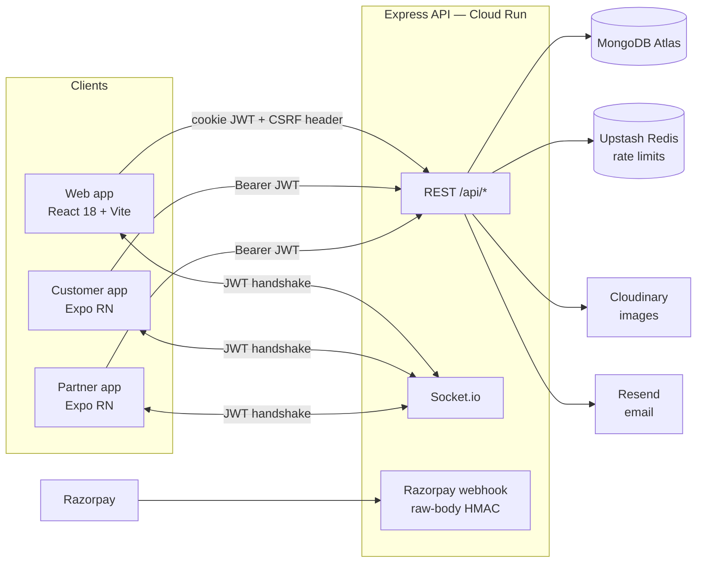

# Tiffo — Architecture

Last updated: July 2026

## System overview

## Backend (`backend/src`)

**Middleware order in `app.js`** (order is load-bearing):
`compression` → `helmet` → CORS allowlist → rate limiter → **webhook route with `express.raw()`** (HMAC needs raw bytes, so it mounts before `express.json()`) → JSON/urlencoded parsers → `cookieParser` → CSRF (double-submit cookie) → `express-mongo-sanitize` → inline XSS sanitizer → ~20 route modules → Swagger (`/api/docs`) → health check → Sentry/error handlers.

**Auth model**
- JWT signed with `JWT_SECRET`, delivered two ways: httpOnly cookie (web) or `Authorization: Bearer` (mobile).
- `middlewares/auth.js` — `protect` verifies the token, loads `req.user`, enforces `isActive` (bans take effect on the next request); `authorize(...roles)` gates by role (`user` / `partner` / `admin`).
- `middlewares/adminAuth.js` — `adminAuth` plus `superAdminAuth` for `isSuperAdmin`-only operations.
- CSRF: stateless HMAC double-submit cookie (`middlewares/csrf.js`). Bearer-token requests are exempt (browsers can't forge that header cross-site).

**Domain layout** — one file per resource in `controllers/`, `routes/`, `models/`, `services/`; admin-only controllers live in `controllers/admin/`. Routes stay thin and delegate to controllers; heavier logic (payments, deliveries, sockets, email) lives in `services/`.

**Payments flow**
1. Client creates a subscription → API creates a Razorpay order.
2. Client completes checkout → `POST /api/payments/verify` checks the payment HMAC signature server-side.
3. Razorpay also calls `POST /api/webhooks/razorpay` (HMAC over raw body). `payment.captured` activates the subscription and generates its delivery schedule inside a Mongo transaction; transfer/refund events update payment logs and notify by email.

**Startup migrations** — `config/database.js` runs idempotent backfills on every boot (email-verification flags, tiffin slugs, default banners).

**Rate limiting** — Upstash Redis sliding window in production (fails open on Redis errors), in-memory `express-rate-limit` fallback in dev. Auth endpoints get a much stricter limit than general API traffic.

## Frontend (`frontend/src`)

- `App.jsx`: `HelmetProvider > ThemeProvider > Redux Provider > SocketProvider > Router`; every page is `React.lazy`-loaded behind an `ErrorBoundary` that reports to Sentry.
- Routing splits three ways: public, authenticated (`ProtectedRoute`), and role-gated `/partner/*` + `/admin/*` (`RoleRoute`).
- `services/api.js` is the single Axios instance: `withCredentials` cookie auth, attaches `X-CSRF-Token` on mutating requests, redirects to `/login` on 401. Domain services wrap it.
- Global state is Redux Toolkit (`store/slices/*`). `@tanstack/react-query` is installed but **not used** on web (it is used in the mobile apps).
- Styling: Tailwind (`darkMode: 'class'`), Headless UI, Framer Motion.

## Mobile (`mobile/`, `mobile-partner/`)

Both are Expo apps with React Navigation v6, TypeScript strict, `AuthContext` for session state, and TanStack Query for server state. They share one Axios/Socket.io client from `shared-mobile/` (linked by hand-rolled Metro `watchFolders` + TS paths). Each app uses distinct AsyncStorage keys (`auth_token` vs `partner_auth_token`) so both sessions can coexist on one device. The base URL is hardcoded to `https://api.tiffo.in` in `shared-mobile/src/services/api.ts` — edit locally for dev, revert before committing.

## Deployment

- `cloudbuild.yaml` → two Docker images (backend `node:22-alpine`, frontend Vite build served by `nginx:alpine`) → Cloud Run `us-central1`.
- Mobile: EAS builds, separate `projectId` per app; `eas-build-pre-install` installs `shared-mobile` deps.
- CI (GitHub Actions): backend lint + jest, frontend lint + build, Docker build validation on both Dockerfiles.

## Key decisions on record

- **Cookie JWT for web, Bearer for mobile** — keeps web tokens out of JS (XSS-resistant) while letting mobile clients manage their own storage.
- **Stateless CSRF (HMAC double-submit)** — no server session store needed; pairs with the cookie-auth choice.
- **Idempotent boot migrations over a migration tool** — acceptable at current schema-change rate; revisit if migrations become order-dependent.
- **Monorepo without workspaces** — each app deploys independently; the cost is manual dependency duplication and the hand-rolled `shared-mobile` link.
